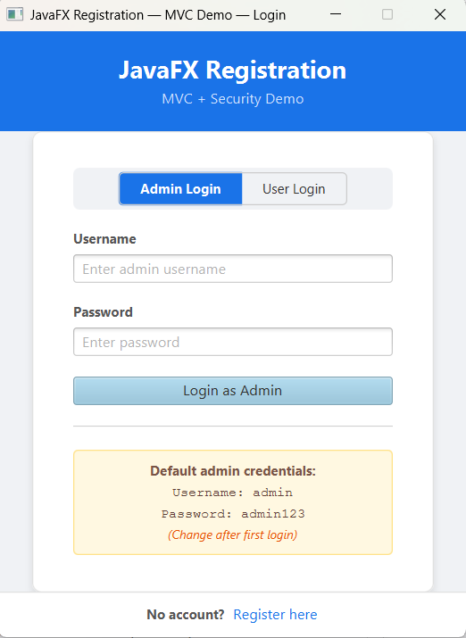
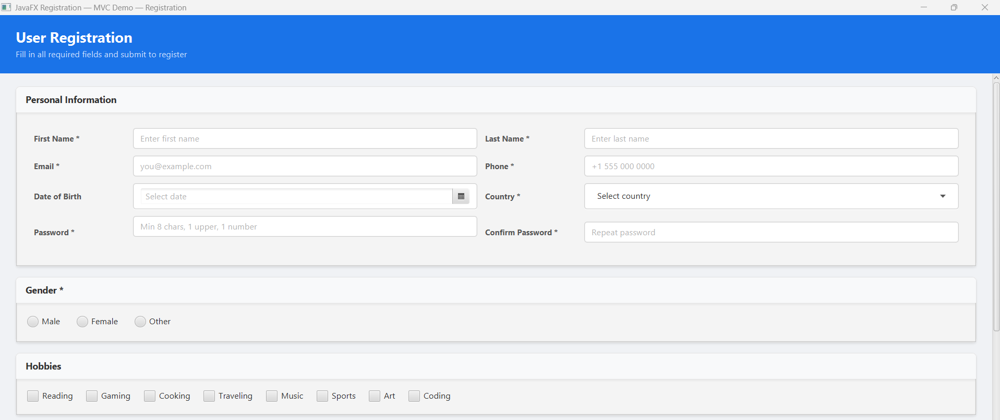
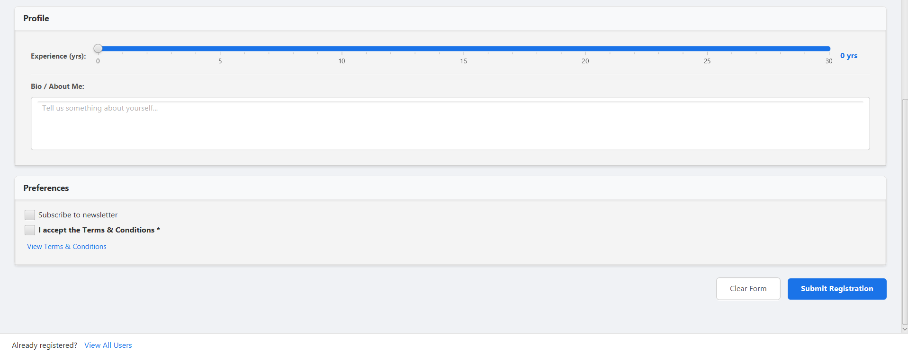
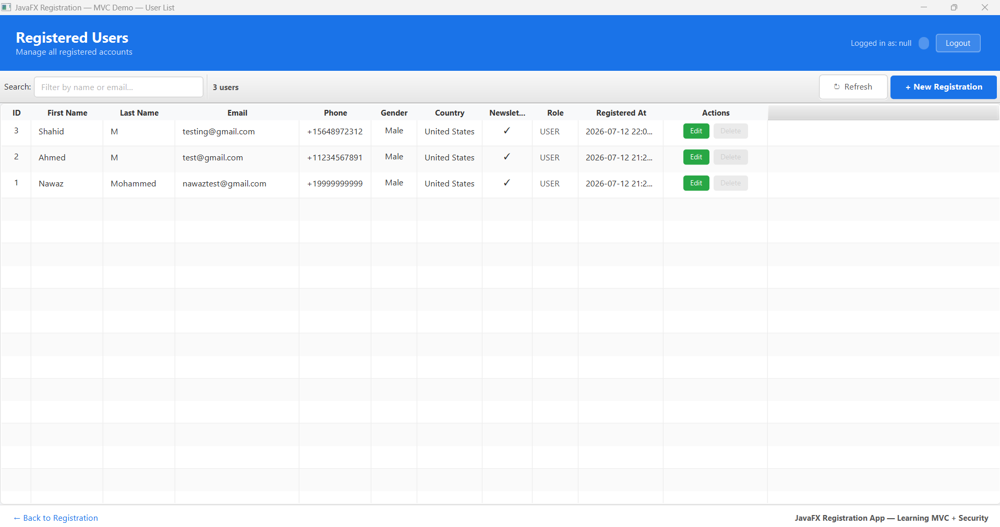
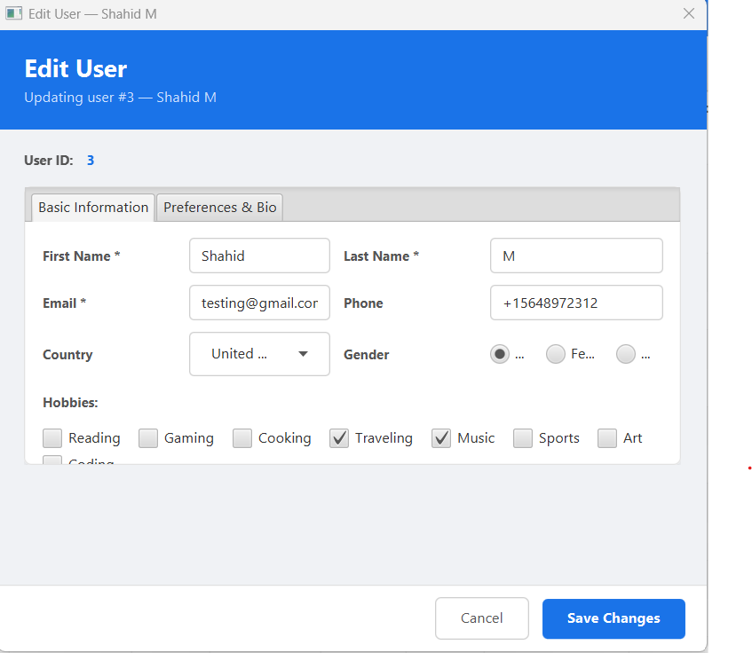
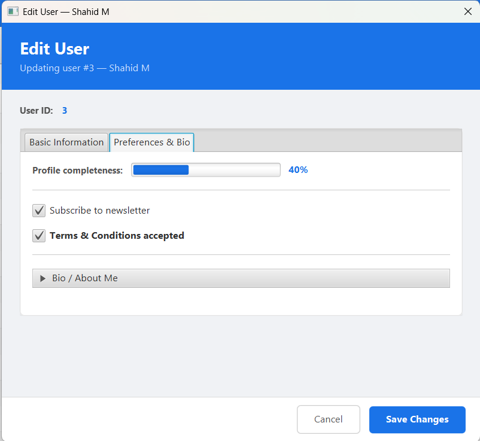

# JavaFX Registration App

A fully functional **JavaFX desktop application** built with the **MVC pattern**,
demonstrating every major UI component, SQLite persistence, BCrypt security,
role-based access control, and an audit log.

---

## Tech Stack

| Layer | Technology |
|-------|-----------|
| UI Framework | JavaFX 22 + FXML |
| Language | Java 17 |
| Architecture | MVC (Model-View-Controller) |
| Database | SQLite (via sqlite-jdbc) |
| Password Security | BCrypt (jbcrypt) |
| Build Tool | Maven |

---

## Full Navigation Flow

```
                    ┌──────────────────────────────────┐
                    │         APP STARTS               │
                    └─────────────┬────────────────────┘
                                  │
                                  ▼
          ┌───────────────────────────────────────────┐
          │              LOGIN SCREEN                  │
          │  ┌─────────────────┐  ┌─────────────────┐ │
          │  │  Admin Login    │  │   User Login    │ │
          │  │  (username +    │  │  (email +       │ │
          │  │   password)     │  │   password)     │ │
          │  └────────┬────────┘  └────────┬────────┘ │
          │           │  success            │  success  │
          └───────────┼─────────────────────┼───────────┘
                      │                     │
                      └──────────┬──────────┘
                                 │
              "Register here" ◄──┤──► login success
                      │          │
                      ▼          ▼
    ┌─────────────────────┐   ┌─────────────────────────────────────────┐
    │  REGISTRATION FORM  │   │            USER LIST                    │
    │                     │   │                                         │
    │  Personal Info      │   │  TableView: ID, Name, Email, Phone,     │
    │  Password + Confirm │   │  Gender, Country, Newsletter, Role,     │
    │  Gender (Radio)     │   │  Registered At, Actions                 │
    │  Hobbies (Checkbox) │   │                                         │
    │  Experience (Slider)│   │  [Edit]   → opens Edit Modal            │
    │  Bio (TextArea)     │   │  [Delete] → admin only, confirms first  │
    │  Newsletter         │   │  [Search] → filters live               │
    │  Terms & Conditions │   │  [Refresh]→ reloads from DB            │
    │                     │   │  [+ New Registration] ──────────────┐  │
    │  [Clear Form]       │   │  [← Back to Registration] ──────────┘  │
    │  [Submit] ──────────┼───►  [Logout] → back to Login              │
    └─────────────────────┘   └──────────────────┬──────────────────────┘
                                                  │ Edit button
                                                  ▼
                                ┌─────────────────────────────────┐
                                │         EDIT USER MODAL         │
                                │                                 │
                                │  ┌─────────────┬─────────────┐  │
                                │  │ Basic Info  │Preferences  │  │
                                │  │             │& Bio        │  │
                                │  │ Name        │ProgressBar  │  │
                                │  │ Email       │ Newsletter  │  │
                                │  │ Phone       │ Terms       │  │
                                │  │ Country     │ Bio (Acc.)  │  │
                                │  │ Gender      │             │  │
                                │  │ Hobbies     │             │  │
                                │  └─────────────┴─────────────┘  │
                                │                                 │
                                │  [Cancel]    [Save Changes]     │
                                └─────────────────────────────────┘
```

---

## Screen 1 — Login

> **Entry point of the app. Nothing is accessible without valid credentials.**



**What you can do here:**
- Toggle between **Admin Login** (username) and **User Login** (email) using the tab buttons
- Enter credentials and press **Login as Admin** or **Login as User**
- Click **Register here** at the bottom to go to the Registration form without logging in

**Navigation from here:**
| Action | Goes to |
|--------|---------|
| Successful admin login | User List |
| Successful user login | User List |
| Click "Register here" | Registration Form |

**Default admin credentials:**
```
Username : admin
Password : admin123
```

---

## Screen 2 — Registration Form (Personal Info)

> **Scrollable form demonstrating every major JavaFX UI component.**



**Components on this screen:**
| Component | Field |
|-----------|-------|
| `TextField` | First Name, Last Name, Email, Phone |
| `DatePicker` | Date of Birth |
| `ComboBox` | Country (dropdown) |
| `PasswordField` | Password (with live strength indicator) |
| `PasswordField` | Confirm Password |
| `RadioButton` + `ToggleGroup` | Gender — Male / Female / Other |
| `CheckBox` (×8) | Hobbies — Reading, Gaming, Cooking, Traveling, Music, Sports, Art, Coding |
| `TitledPane` | Section card wrapper |
| `GridPane` | Two-column form layout |

**Navigation from here:**
| Action | Goes to |
|--------|---------|
| Scroll down | Profile & Preferences section |
| Click "View All Users" (bottom) | User List |

---

## Screen 3 — Registration Form (Profile & Preferences)

> **Bottom half of the scrollable registration form.**



**Components on this screen:**
| Component | Field |
|-----------|-------|
| `Slider` | Years of experience (0–30, live label update) |
| `TextArea` | Bio / About Me (multi-line, wrappable) |
| `CheckBox` | Subscribe to newsletter |
| `CheckBox` | Accept Terms & Conditions (required) |
| `Hyperlink` | View Terms & Conditions (opens Alert dialog) |
| `Separator` | Visual divider |
| `ScrollPane` | Wraps the entire form |
| `Button` | Clear Form (secondary) |
| `Button` | Submit Registration (primary, default) |

**Password rules enforced before submit:**
- Minimum 8 characters
- At least 1 uppercase letter
- At least 1 number
- Both password fields must match
- Plain-text password is **never stored** — BCrypt hash only

**Navigation from here:**
| Action | Goes to |
|--------|---------|
| Click "Submit Registration" (valid form) | User List |
| Click "View All Users" | User List |
| Click "Clear Form" | Stays — resets all fields |

---

## Screen 4 — User List

> **Central hub of the app. Shows all registered users with full management actions.**



**What's on this screen:**
| Element | Description |
|---------|-------------|
| Session banner (top-right) | Shows logged-in username + role badge (ADMIN/USER) |
| Logout button | Clears session → back to Login |
| Search box | Filters all rows live as you type (name, email, country) |
| User count | Updates with the filtered count |
| TableView | 11 columns: ID, First Name, Last Name, Email, Phone, Gender, Country, Newsletter, Role, Registered At, Actions |
| Edit button (green) | Opens Edit User modal — available to all users |
| Delete button (red) | Confirms then deletes — **admin only**, greyed out for regular users |
| Refresh button | Reloads all users from the database |
| + New Registration | Navigates to Registration Form |
| ← Back to Registration | Navigates to Registration Form |

**Navigation from here:**
| Action | Goes to |
|--------|---------|
| Click Edit on a row | Edit User modal (same window stays open) |
| Click Delete → confirm | Deletes row, stays on User List |
| Click + New Registration | Registration Form |
| Click ← Back | Registration Form |
| Click Logout | Login Screen |

---

## Screen 5 — Edit User (Basic Information Tab)

> **Modal dialog pre-populated with the selected user's data. Opens over the User List.**



**Tab 1 — Basic Information:**
| Component | Field |
|-----------|-------|
| `Label` | User ID (read-only) |
| `TabPane` | Two tabs: Basic Information / Preferences & Bio |
| `TextField` | First Name, Last Name, Email, Phone |
| `ComboBox` | Country (pre-selected) |
| `RadioButton` + `ToggleGroup` | Gender (pre-selected from saved data) |
| `CheckBox` (×8) | Hobbies (pre-ticked from saved data) |
| `GridPane` | Two-column layout |
| `Tooltip` | Hints on each input field |

**Navigation from here:**
| Action | Goes to |
|--------|---------|
| Click "Preferences & Bio" tab | Tab 2 of same modal |
| Click Save Changes (valid) | Closes modal → User List refreshes |
| Click Cancel | Closes modal → User List unchanged |

---

## Screen 6 — Edit User (Preferences & Bio Tab)

> **Second tab of the Edit User modal — profile completeness and preferences.**



**Tab 2 — Preferences & Bio:**
| Component | Field |
|-----------|-------|
| `ProgressBar` | Profile completeness % (updates live as checkboxes are ticked) |
| `CheckBox` | Subscribe to newsletter (pre-ticked from saved data) |
| `CheckBox` | Terms & Conditions accepted (pre-ticked) |
| `Accordion` | Collapsible Bio / About Me section |
| `TitledPane` | Inside Accordion — expands to show TextArea |
| `Separator` | Visual dividers |

**Navigation from here:**
| Action | Goes to |
|--------|---------|
| Click "Basic Information" tab | Tab 1 of same modal |
| Click Save Changes | Closes modal → User List refreshes |
| Click Cancel | Closes modal → User List unchanged |

---

## JavaFX Components — Complete Reference

| Component | Used in |
|-----------|---------|
| `TextField` | Registration, Edit User |
| `PasswordField` | Login, Registration |
| `DatePicker` | Registration |
| `ComboBox` | Registration, Edit User |
| `RadioButton` + `ToggleGroup` | Registration (gender), Edit User (gender) |
| `ToggleButton` + `ToggleGroup` | Login (Admin/User mode switcher) |
| `CheckBox` | Registration (hobbies, newsletter, terms), Edit User |
| `TextArea` | Registration bio, Edit User bio |
| `Slider` | Registration (years of experience) |
| `TableView` + `TableColumn` | User List |
| `Button` | All screens |
| `Hyperlink` | Registration (Terms & Conditions link) |
| `Label` | All screens |
| `Separator` | Registration, Edit User |
| `ToolBar` | User List |
| `TitledPane` | Registration (section cards) |
| `TabPane` + `Tab` | Edit User (2 tabs) |
| `Accordion` | Edit User (collapsible Bio) |
| `ProgressBar` | Edit User (profile completeness) |
| `Tooltip` | Edit User (field hints, disabled Delete hint) |
| `Alert` | Confirmation dialogs, Terms popup |
| `BorderPane` | Root layout — all screens |
| `VBox` | Vertical stacking — all screens |
| `HBox` | Horizontal stacking — all screens |
| `GridPane` | Two-column form layout |
| `FlowPane` | Wrapping hobby checkboxes |
| `ScrollPane` | Scrollable registration form |

---

## MVC Architecture

```
┌──────────────────────────────────────────────────────────────────┐
│  VIEW  (FXML + ViewController)                                   │
│  login.fxml         ↔  LoginViewController                       │
│  registration.fxml  ↔  RegistrationViewController               │
│  userlist.fxml      ↔  UserListViewController                    │
│  edituser.fxml      ↔  EditUserViewController                    │
│                              │  calls only                       │
├──────────────────────────────▼───────────────────────────────────┤
│  SECURITY                                                        │
│  AuthController   — BCrypt login, password hashing + validation  │
│  SessionManager   — who is logged in, role, isAdmin()            │
│                              │  used by                          │
├──────────────────────────────▼───────────────────────────────────┤
│  CONTROLLER                                                      │
│  UserController   — registerUser / updateUser / deleteUser       │
│                     validation + audit log on every write        │
│                              │  calls only                       │
├──────────────────────────────▼───────────────────────────────────┤
│  MODEL                                                           │
│  User.java          — data entity (POJO)                         │
│  DatabaseHelper     — SQLite CRUD, Singleton, 3 tables           │
└──────────────────────────────────────────────────────────────────┘
```

> **Key rule:** Views never call `DatabaseHelper` directly.
> All data flows through `UserController` or `AuthController`.

---

## Security Features

| Feature | Implementation |
|---------|---------------|
| Password hashing | BCrypt, cost factor 12 — never stored as plain text |
| Password strength | 8+ chars, 1 uppercase, 1 digit — live UI feedback |
| Login gate | App opens on Login screen — no bypass |
| Session management | `SessionManager` static holder — cleared on logout |
| Role-based access | Delete gated to `admin` role (UI disabled + controller enforced) |
| Audit trail | Every INSERT / UPDATE / DELETE logged to `audit_log` table |
| SQL injection prevention | All queries use `PreparedStatement` |
| Generic login errors | "Invalid username or password" — no hint which field failed |

---

## Database Tables

SQLite file `users.db` created automatically on first launch.

| Table | Purpose |
|-------|---------|
| `users` | Registered accounts — includes `password_hash` + `role` |
| `admin_users` | Admin credentials — seeded with `admin` / `admin123` |
| `audit_log` | Append-only record of every insert / update / delete |

---

## How to Run

### Prerequisites
- JDK 17 or 21 — [adoptium.net](https://adoptium.net)
- Maven 3.8+ — [maven.apache.org](https://maven.apache.org)

### One-time Maven setup
Create `C:\Users\<you>\.m2\settings.xml`:
```xml
<settings>
  <pluginGroups>
    <pluginGroup>org.openjfx</pluginGroup>
  </pluginGroups>
</settings>
```

### Run
```cmd
cd javafx-registration
del users.db
mvn clean compile
mvn javafx:run
```

> Delete `users.db` on first run after a fresh clone so the new schema is created cleanly.

---

## Project Structure

```
javafx-registration/
├── pom.xml
├── README.md
├── HOW_TO_RUN.md
├── JAVAFX_INTERVIEW_GUIDE.md
├── docs/screenshots/
│   ├── 01-login.png
│   ├── 02-registration-top.png
│   ├── 03-registration-bottom.png
│   ├── 04-user-list.png
│   ├── 05-edit-basic.png
│   └── 06-edit-preferences.png
└── src/main/
    ├── java/
    │   ├── module-info.java
    │   └── com/learn/registration/
    │       ├── App.java
    │       ├── model/User.java
    │       ├── database/DatabaseHelper.java
    │       ├── security/AuthController.java
    │       ├── security/SessionManager.java
    │       ├── controller/UserController.java
    │       └── view/
    │           ├── LoginViewController.java
    │           ├── RegistrationViewController.java
    │           ├── UserListViewController.java
    │           └── EditUserViewController.java
    └── resources/com/learn/registration/
        ├── css/style.css
        └── view/
            ├── login.fxml
            ├── registration.fxml
            ├── userlist.fxml
            └── edituser.fxml
```

---

*Built as a JavaFX learning reference — covers MVC architecture, every major
UI component, BCrypt security, and SQLite persistence in a single runnable project.*
